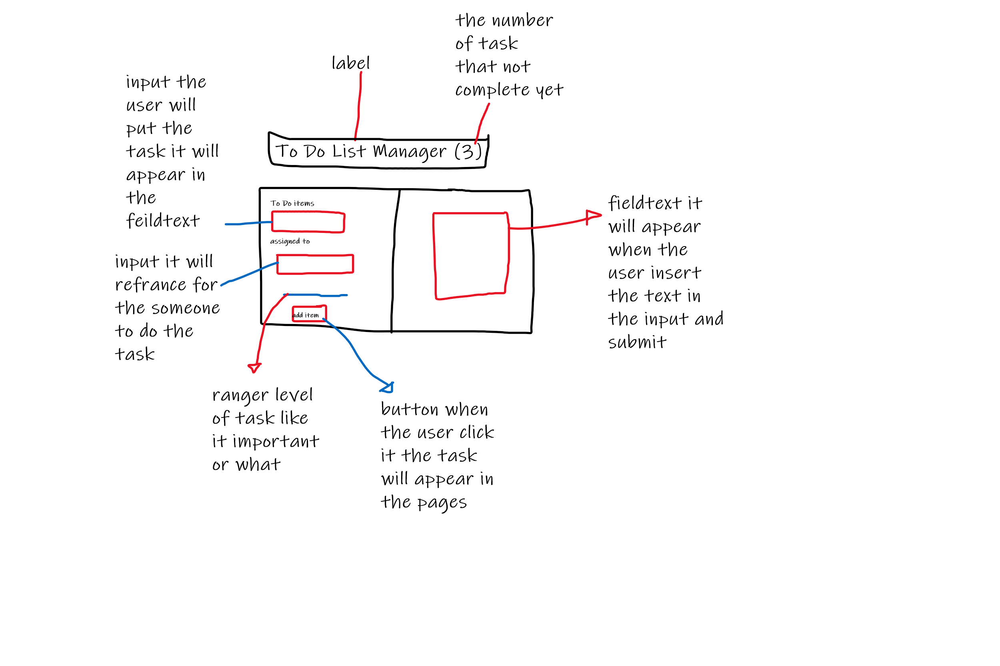
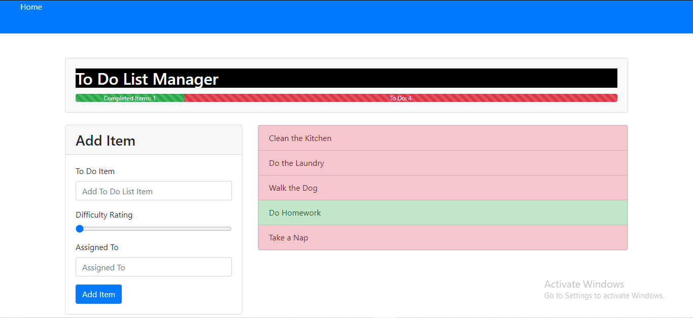
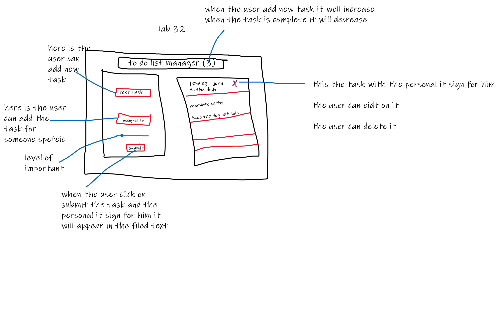
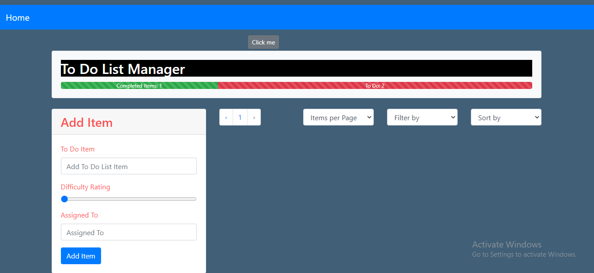
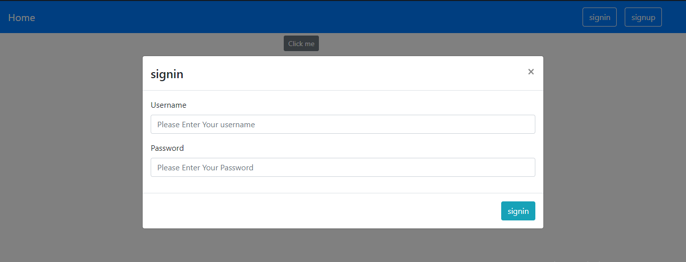
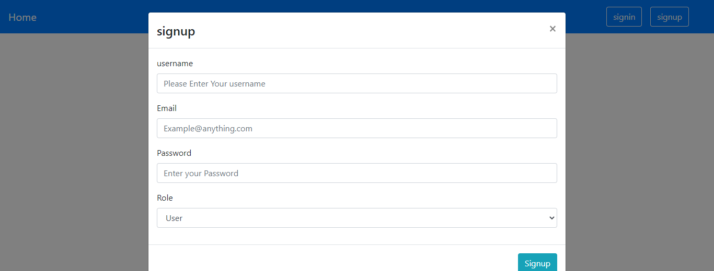

# todo

this app create by react and function component to make user or manager can make list item for the doing task for his employees

## The package using

[axios](https://www.npmjs.com/package/axios)

Promise based HTTP client for the browser and node.js

[cors](https://www.npmjs.com/package/cors)

CORS is a node.js package for providing a Connect/Express middleware that can be used to enable CORS with various options.

[bootstrap](https://www.npmjs.com/package/bootstrap)

Sleek, intuitive, and powerful front-end framework for faster and easier web development.

[sass](https://www.npmjs.com/package/sass)

This package is a distribution of Dart Sass, compiled to pure JavaScript with no native code or external dependencies.

[cookies](https://www.npmjs.com/package/cookies)

Cookies is a node.js module for getting and setting HTTP(S) cookies. Cookies can be signed to prevent tampering, using Keygrip.

[jsonwebtoken](https://www.npmjs.com/package/jsonwebtoken)

An implementation of JSON Web Tokens.

[superagent](https://www.npmjs.com/package/superagent)

Small progressive client-side HTTP request library, and Node.js module with the same API, supporting many high-level HTTP client features

[react-uuid](https://www.npmjs.com/package/react-uuid)

React's power lies in its robust reconciliation process. When we use JSX to create or update components, React creates its own virtual DOM.

[react-if](https://www.npmjs.com/package/react-if)

It is important to note that, because JavaScript is an eagerly evaluated language, children of both the Then and Else component and condition will be evaluated regardless of the value of the condition.

[react-router](https://www.npmjs.com/package/react-router)

This package provides the core routing functionality for React Router, but you might not want to install it directly.

[react](https://www.npmjs.com/package/react)

The react package contains only the functionality necessary to define React components.

[react-dom](https://www.npmjs.com/package/react-dom)

This package serves as the entry point to the DOM and server renderers for React. It is intended to be paired with the generic React package, which is shipped as react to npm.

[react-scripts](https://www.npmjs.com/package/react-scripts)

This package includes scripts and configuration used by Create React App.

## deploy link (31)

------------------------

[Live Server](https://naeemmusamh.github.io/todo/)

[GitHub](https://github.com/naeemmusamh/todo)

[Pull Request](https://github.com/naeemmusamh/todo/pull/1)

## structure lab(31)

------------------------

## The Results lab(31)

------------------------

# lab 32 not complete yet

## deploy link

------------------------

[Live Server](https://naeemmusamh.github.io/todo/)

[Pull Request](https://github.com/naeemmusamh/todo/pull/3)

## structure lab(32)

------------------------

# lab 33 complete with lab 32

## deploy link

------------------------

[Live Server](https://naeemmusamh.github.io/todo/)

[Pull Request](https://github.com/naeemmusamh/todo/pull/5)

## structure lab(33)

------------------------

# lab 34

## deploy link

------------------------

[Live Server](https://naeemmusamh.github.io/todo/)

[Pull Request](https://github.com/naeemmusamh/todo/pull/7)

## structure lab 34

------------------------

